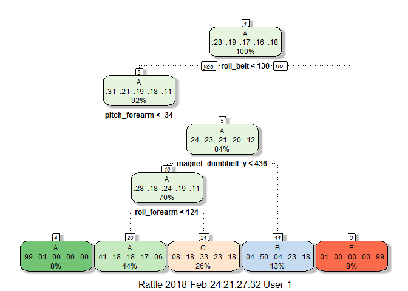

## Introduction

Using devices such as Jawbone Up, Nike FuelBand, and Fitbit, it is now possible to collect a large amount of data about personal activity relatively inexpensively. These type of devices are part of the quantified self movement - a group of enthusiasts who take measurements about themselves regularly to improve their health, to find patterns in their behavior, or because they are tech geeks. One thing that people regularly do is quantify how much of a particular activity they do, but they rarely quantify how well they do it.

In this project, we will use data from accelerometers on the belt, forearm, arm, and dumbbell of 6 participants. They were asked to perform barbell lifts correctly and incorrectly in 5 different ways. The five ways are labelled Class A, B, C, D, E, respectively, with only Class A corresponding to correct performance. The goal of this project is to predict the manner in which they did the exercise. More information is available on: http://groupware.les.inf.puc-rio.br/har (see the section on the Weight Lifting Exercise Dataset).

## Data Importing 

Ensuring the results of the R code are printed out:


```r
echo=TRUE
```

Loading needed libraries:


```r
suppressMessages(library(caret)); suppressMessages(library(rattle)); suppressMessages(library(rpart)); suppressMessages(library(rpart.plot)); suppressMessages(library(randomForest)); suppressMessages(library(knitr))
```

```
## Warning: package 'caret' was built under R version 3.4.3
```

```
## Warning: package 'rattle' was built under R version 3.4.3
```

```
## Warning: package 'rpart' was built under R version 3.4.3
```

```
## Warning: package 'rpart.plot' was built under R version 3.4.3
```

```
## Warning: package 'randomForest' was built under R version 3.4.3
```

```
## Warning: package 'knitr' was built under R version 3.4.3
```

Loading training and testing datasets and checking their dimensions:


```r
TrainData <- read.csv("pml-training.csv", na.strings = c("NA", ""))
dim(TrainData)
```

```
## [1] 19622   160
```


```r
TestData <- read.csv("pml-testing.csv", na.strings = c("NA", ""))
dim(TestData)
```

```
## [1]  20 160
```

## Data Cleaning

The training dataset consists of 19622 observations and 160 variables (columns). While the testing dataset consists of 20 observations and 160 variables (columns). By inspecting the datasets, We notice that many columns have NA or blank values on almost every observation. So we will remove them, because they will not produce any information. We will also remove the first seven columns which give information about the people who did the test, and the timestamps of their activities. 


```r
# Removing columns containing missing values from datasets
TrainData <- TrainData[, colSums(is.na(TrainData)) == 0]
TestData <- TestData[, colSums(is.na(TestData)) == 0]
```


```r
# Removing the first 7 columns from datasets
TrainData_Clean <- TrainData[, -c(1:7)]
TestData_Clean <- TestData[, -c(1:7)]
```

Listing the variables (column names) of cleaned datasets: 


```r
colnames(TrainData_Clean)
```

```
##  [1] "roll_belt"            "pitch_belt"           "yaw_belt"            
##  [4] "total_accel_belt"     "gyros_belt_x"         "gyros_belt_y"        
##  [7] "gyros_belt_z"         "accel_belt_x"         "accel_belt_y"        
## [10] "accel_belt_z"         "magnet_belt_x"        "magnet_belt_y"       
## [13] "magnet_belt_z"        "roll_arm"             "pitch_arm"           
## [16] "yaw_arm"              "total_accel_arm"      "gyros_arm_x"         
## [19] "gyros_arm_y"          "gyros_arm_z"          "accel_arm_x"         
## [22] "accel_arm_y"          "accel_arm_z"          "magnet_arm_x"        
## [25] "magnet_arm_y"         "magnet_arm_z"         "roll_dumbbell"       
## [28] "pitch_dumbbell"       "yaw_dumbbell"         "total_accel_dumbbell"
## [31] "gyros_dumbbell_x"     "gyros_dumbbell_y"     "gyros_dumbbell_z"    
## [34] "accel_dumbbell_x"     "accel_dumbbell_y"     "accel_dumbbell_z"    
## [37] "magnet_dumbbell_x"    "magnet_dumbbell_y"    "magnet_dumbbell_z"   
## [40] "roll_forearm"         "pitch_forearm"        "yaw_forearm"         
## [43] "total_accel_forearm"  "gyros_forearm_x"      "gyros_forearm_y"     
## [46] "gyros_forearm_z"      "accel_forearm_x"      "accel_forearm_y"     
## [49] "accel_forearm_z"      "magnet_forearm_x"     "magnet_forearm_y"    
## [52] "magnet_forearm_z"     "classe"
```


```r
colnames(TestData_Clean)
```

```
##  [1] "roll_belt"            "pitch_belt"           "yaw_belt"            
##  [4] "total_accel_belt"     "gyros_belt_x"         "gyros_belt_y"        
##  [7] "gyros_belt_z"         "accel_belt_x"         "accel_belt_y"        
## [10] "accel_belt_z"         "magnet_belt_x"        "magnet_belt_y"       
## [13] "magnet_belt_z"        "roll_arm"             "pitch_arm"           
## [16] "yaw_arm"              "total_accel_arm"      "gyros_arm_x"         
## [19] "gyros_arm_y"          "gyros_arm_z"          "accel_arm_x"         
## [22] "accel_arm_y"          "accel_arm_z"          "magnet_arm_x"        
## [25] "magnet_arm_y"         "magnet_arm_z"         "roll_dumbbell"       
## [28] "pitch_dumbbell"       "yaw_dumbbell"         "total_accel_dumbbell"
## [31] "gyros_dumbbell_x"     "gyros_dumbbell_y"     "gyros_dumbbell_z"    
## [34] "accel_dumbbell_x"     "accel_dumbbell_y"     "accel_dumbbell_z"    
## [37] "magnet_dumbbell_x"    "magnet_dumbbell_y"    "magnet_dumbbell_z"   
## [40] "roll_forearm"         "pitch_forearm"        "yaw_forearm"         
## [43] "total_accel_forearm"  "gyros_forearm_x"      "gyros_forearm_y"     
## [46] "gyros_forearm_z"      "accel_forearm_x"      "accel_forearm_y"     
## [49] "accel_forearm_z"      "magnet_forearm_x"     "magnet_forearm_y"    
## [52] "magnet_forearm_z"     "problem_id"
```

Both cleaned datasets have 53 columns with the same first 52 variables. The last variable in TrainData_Clean is "classe"", and the last variable in TestData_Clean is "problem_id". TrainData_Clean has 19622 rows while TestData_Clean has 20 rows.

## Data Partitioning

In order to get out-of-sample errors, we split the cleaned training dataset TrainData_Clean into a training set (70%) for prediction and a validation set (30%) to compute the out-of-sample errors.


```r
set.seed(345) 
xTrain <- createDataPartition(TrainData_Clean$classe, p = 0.7, list = FALSE)
training70 <- TrainData_Clean[xTrain, ]
validate30 <- TrainData_Clean[-xTrain, ]
```

## Prediction Model Algorithms

We apply the "Classification Trees"" and "Random Forests" algorithms to predict the outcome variable.

### Classification Trees

Here we use k-fold cross-validation when applying the algorithm, with k=5 (instead of the default k=10) to save on computing time. 


```r
control <- trainControl(method = "cv", number = 5)
rpart_fitting <- train(classe ~ ., data = training70, method = "rpart", 
                   trControl = control)
print(rpart_fitting, digits = 4)
```

```
## CART 
## 
## 13737 samples
##    52 predictor
##     5 classes: 'A', 'B', 'C', 'D', 'E' 
## 
## No pre-processing
## Resampling: Cross-Validated (5 fold) 
## Summary of sample sizes: 10988, 10991, 10991, 10988, 10990 
## Resampling results across tuning parameters:
## 
##   cp       Accuracy  Kappa 
##   0.03489  0.5009    0.3482
##   0.06046  0.4427    0.2532
##   0.11637  0.3325    0.0737
## 
## Accuracy was used to select the optimal model using the largest value.
## The final value used for the model was cp = 0.03489.
```


```r
fancyRpartPlot(rpart_fitting$finalModel)
```

<!-- -->


```r
# Predicting the outcomes using the validation set
rpart_predict <- predict(rpart_fitting, validate30)
# Showing the prediction results
(rpart_matrix <- confusionMatrix(validate30$classe, rpart_predict))
```

```
## Confusion Matrix and Statistics
## 
##           Reference
## Prediction    A    B    C    D    E
##          A 1533   23  113    0    5
##          B  493  374  272    0    0
##          C  490   27  509    0    0
##          D  441  161  362    0    0
##          E  151  156  297    0  478
## 
## Overall Statistics
##                                           
##                Accuracy : 0.4918          
##                  95% CI : (0.4789, 0.5046)
##     No Information Rate : 0.5281          
##     P-Value [Acc > NIR] : 1               
##                                           
##                   Kappa : 0.335           
##  Mcnemar's Test P-Value : NA              
## 
## Statistics by Class:
## 
##                      Class: A Class: B Class: C Class: D Class: E
## Sensitivity            0.4932  0.50472  0.32775       NA  0.98965
## Specificity            0.9492  0.85128  0.88066   0.8362  0.88819
## Pos Pred Value         0.9158  0.32836  0.49610       NA  0.44177
## Neg Pred Value         0.6260  0.92267  0.78514       NA  0.99896
## Prevalence             0.5281  0.12591  0.26389   0.0000  0.08207
## Detection Rate         0.2605  0.06355  0.08649   0.0000  0.08122
## Detection Prevalence   0.2845  0.19354  0.17434   0.1638  0.18386
## Balanced Accuracy      0.7212  0.67800  0.60420       NA  0.93892
```


```r
(rpart_accuracy <- rpart_matrix$overall[1])
```

```
##  Accuracy 
## 0.4917587
```

From the confusion matrix above, we see that the accuracy rate is around 0.5, and therefore the out-of-sample error rate is about 0.5. This means applying the Classification Tree algorithm does not predict the outcome "classe"" very well.

### Random Forest 

Since the Classification Tree algorithm did not perform well in this case, we then try the Random Forest algorithm instead.


```r
rf_fitting <- train(classe ~ ., data = training70, method = "rf", 
                   trControl = control)
print(rf_fitting, digits = 4)
```

```
## Random Forest 
## 
## 13737 samples
##    52 predictor
##     5 classes: 'A', 'B', 'C', 'D', 'E' 
## 
## No pre-processing
## Resampling: Cross-Validated (5 fold) 
## Summary of sample sizes: 10990, 10991, 10989, 10990, 10988 
## Resampling results across tuning parameters:
## 
##   mtry  Accuracy  Kappa 
##    2    0.9908    0.9884
##   27    0.9913    0.9890
##   52    0.9836    0.9793
## 
## Accuracy was used to select the optimal model using the largest value.
## The final value used for the model was mtry = 27.
```

We then predict the outcomes using the validation set, and show the prediction result and the model accuracy:


```r
rf_predict <- predict(rf_fitting, validate30)
```


```r
(rf_matrix <- confusionMatrix(validate30$classe, rf_predict))
```

```
## Confusion Matrix and Statistics
## 
##           Reference
## Prediction    A    B    C    D    E
##          A 1672    1    0    0    1
##          B    5 1131    3    0    0
##          C    0    8 1016    2    0
##          D    0    1   14  949    0
##          E    0    0    0    4 1078
## 
## Overall Statistics
##                                          
##                Accuracy : 0.9934         
##                  95% CI : (0.991, 0.9953)
##     No Information Rate : 0.285          
##     P-Value [Acc > NIR] : < 2.2e-16      
##                                          
##                   Kappa : 0.9916         
##  Mcnemar's Test P-Value : NA             
## 
## Statistics by Class:
## 
##                      Class: A Class: B Class: C Class: D Class: E
## Sensitivity            0.9970   0.9912   0.9835   0.9937   0.9991
## Specificity            0.9995   0.9983   0.9979   0.9970   0.9992
## Pos Pred Value         0.9988   0.9930   0.9903   0.9844   0.9963
## Neg Pred Value         0.9988   0.9979   0.9965   0.9988   0.9998
## Prevalence             0.2850   0.1939   0.1755   0.1623   0.1833
## Detection Rate         0.2841   0.1922   0.1726   0.1613   0.1832
## Detection Prevalence   0.2845   0.1935   0.1743   0.1638   0.1839
## Balanced Accuracy      0.9983   0.9948   0.9907   0.9953   0.9991
```


```r
(rf_accuracy <- rf_matrix$overall[1])
```

```
## Accuracy 
## 0.993373
```

Here we can see that, with this dataset, Random Forest (RF) is a much better prediction algorithm than Classification Tree. The RF accuracy rate is 0.993, and so the out-of-sample error rate is 0.007. Even though Random Forest proves, in this case, to be highly accurate, its runtime (around 45 minutes) is much longer than Classification Trees runtime (around 1 minute).

## Prediction on Testing Dataset

Finally, we select the highly accurate Random Forest algorithm to predict the outcome variable "classe" for the testing dataset TestData_Clean:


```r
(predict(rf_fitting, TestData_Clean))
```

```
##  [1] B A B A A E D B A A B C B A E E A B B B
## Levels: A B C D E
```


